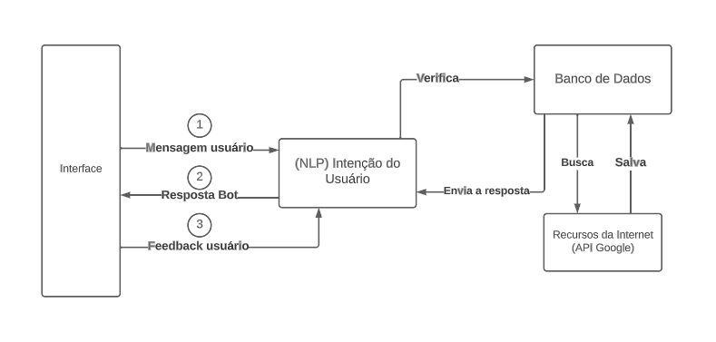

# Aprendizado-Continuo
Mitigando o Concept Drift em Chatbots para Pesquisas Internas na IBM: Uma Abordagem de Aprendizado Contínuo

## Introdução

A crescente adoção de chatbots e assistentes virtuais tem transformado fundamentalmente a maneira como interagimos com a tecnologia e buscamos informações. Esses sistemas conversacionais desempenham um papel cada vez mais crucial em diversas áreas, desde o atendimento ao cliente até a assistência em tarefas do dia a dia. No entanto, apesar dos avanços notáveis na inteligência artificial e no aprendizado de máquina, os chatbots enfrentam um desafio crítico que ameaça sua eficácia a longo prazo: o concept drift.  

O concept drift é um fenômeno complexo no aprendizado de máquina, no qual as propriedades estatísticas da variável alvo mudam com o tempo. Isso implica que um modelo treinado com dados iniciais pode se tornar menos preciso à medida que as condições do ambiente evoluem. No contexto dos chatbots, o concept drift se manifesta de maneira única e desafiadora, surgindo quando a linguagem utilizada pelos usuários se modifica ao longo do tempo ou quando os tópicos discutidos se tornam obsoletos. Este trabalho se propõe a explorar estratégias e abordagens para enfrentar esse desafio, com o intuito de assegurar a confiabilidade e a continuidade do conhecimento adquirido no projeto desenvolvido no módulo 7.  

## Solução Proposta
O chatbot tem o poder de desempenhar um papel fundamental no ambiente de trabalho da IBM, facilitando pesquisas internas, fornecendo suporte rápido e auxiliando na obtenção de informações. No entanto, à medida que os funcionários interagem com esse chatbot ao longo do tempo, o concept drift pode se tornar um desafio crítico para a aplicação. Neste contexto, descreverei uma possível solução para mitigar esse desafio.

#### Implementação da Abordagem:

A coleta de feedback dos usuários e a incorporação de aprendizado contínuo são elementos críticos para aprimorar a eficácia e a relevância do chatbot ao longo do tempo. A seguir, descrevo a implementação de um sistema de coleta de feedback para lidar com o desafio do concept drift:

##### *Coleta de Feedback do Usuário*
A interação começa quando o chatbot fornece uma resposta ou assistência com base em seu conhecimento atual. Após cada resposta, o chatbot educadamente solicita ao usuário que forneça feedback sobre a qualidade e a relevância da resposta. Para facilitar o processo, são oferecidas opções de feedback, como "Sim, a resposta foi útil", "Não, a resposta não foi útil" ou "Estou indeciso". Além disso, os usuários podem fornecer comentários detalhados, caso desejem explicar suas respostas ou sugerir melhorias.

##### *Processamento de Feedback e Aprendizado*
Periodicamente, o sistema processa o feedback coletado dos usuários. A análise de sentimentos é usada para avaliar o nível de satisfação, e os comentários detalhados são revisados. Com base nessa análise, o chatbot atualiza seus modelos de aprendizado. Se muitos usuários relatam que uma resposta específica não é útil, o modelo pode ser ajustado para evitar fornecer essa resposta no futuro.

  

## Conclusão

Na nossa busca por soluções para mitigar o concept drift em chatbots, exploramos a abordagem da coleta de feedback dos usuários para o aprendizado contínuo. Essa estratégia demonstrou ser um caminho promissor para manter a relevância e a eficácia do sistema de conversação ao longo do tempo.

A implementação dessa solução não é tarefa simples; envolve esforços em termos de design, desenvolvimento, coleta de dados e manutenção contínua. Além disso, desafios, como a aquisição de conhecimento errôneo e a necessidade de revisar modelos de aprendizado, também são preocupações relevantes.

No entanto, acredito que sua implementação tem um potencial benefício imenso. Ao incorporar a coleta de feedback para o aprendizado contínuo do chatbot, não estamos apenas melhorando a eficácia dessa ferramenta, mas também aprimorando a experiência do usuário da IBM.

Em suma, a implementação do sistema de feedback na ferramenta de pesquisa da IBM fará com que ela continue a evoluir para atender às crescentes expectativas dos usuários.

## Referências bibliográficas.

Liu, B.; Mazumder, S. (Ano de publicação). Lifelong and Continual Learning Dialogue Systems: Learning during Conversation. Universidade de Illinois em Chicago, Departamento de Ciência da Computação.

